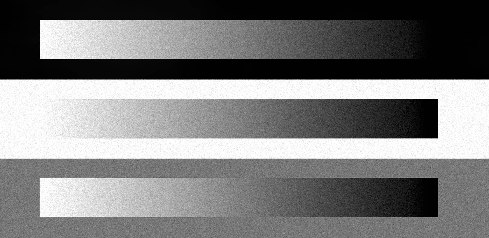

# Photographic Grain Synthesis

**A physically-parameterized, multi-population model of silver-halide grain formation, built from procedural crystal synthesis and full-field convolutional reconstruction.**

> **Status:** work in progress. The core synthesis engine — crystal geometry, multi-population exposure partitioning, adjacency, scattering, shadow roll-off, substrate mottle — is functional. This repository covers grain synthesis only: no color, tone, halation, or diffusion modeling.

<p align="center">
  
  <br>
  <em>[Wedge Test — 6144x3000px - (Filling=1.0, Size=[3, 5, 7], n=40, std=0.25)]</em>
</p>

## Wedge Test Performance Notes

The test wedge is a 6144x3000px image, 16bit .tiff & ROMM. Performed on a 2015 Intel MacBook Pro.

```
==================================================
GRAIN PROFILING REPORT
==================================================
Step 1 (Target Seeding Map):       0.0760 s
Step 2 (Layer Splits):             0.0000 s
Step 3 (Crystal Precomputation):   0.0455 s
Step 4 (Conversions & Roll-off):   5.6257 s
  └─ Loop-Invariant Filters:       4.7488 s
Step 5 (Layer Loop Total):        52.4003 s
  ├─ Seq FFT & Target Prep:        8.7691 s
  ├─ Seq Poisson Seeds:           31.2624 s
  ├─ Shadow Mask Application:      0.5188 s
  └─ 2D FFT Convolution (fft):    11.1605 s
Step 5.5 (Base Fog Mottle):        5.4105 s
Step 6 (Calibration & Output):     0.3000 s
--------------------------------------------------
Total Grain Time:              63.9148 s
==================================================
```

## Abstract

This project synthesizes photographic grain texture by modeling the emulsion as a stack of discrete silver-halide crystal layers, each seeded by a spatial Poisson process and rendered through FFT convolution with a procedurally generated crystal kernel. Grain formation is partitioned across three exposure-weighted populations (fast, medium, slow) to approximate the overlapping sensitivity behavior of a real multi-layer emulsion, and extended with several physically-grounded effects: intra-crystal porosity texture, tabular grain morphology, Nelson-model adjacency, per-layer optical scattering, dynamic shadow roll-off, and acetate substrate mottle. Crystal size, scattering radius, and adjacency range are all specified in physical units (microns) and converted to pixels using the target image's actual resolution against a reference film format. The output image is reconstructed entirely from the synthesized crystal field rather than composited on top of the original pixel values.

## 1. Background

Photographic grain arises from the discrete, randomly-distributed silver halide (AgX) crystals suspended in a gelatin emulsion. Digital emulation of this texture broadly falls into two categories: overlaying a captured or generated noise texture onto an image using a blend mode, or synthesizing grain procedurally from a model of the emulsion driven by the image's own exposure. This project takes the second approach, treating grain formation as a generative process rather than a texture layer.

## 2. Method

### 2.1 Crystal geometry

Each crystal is defined by a polar boundary function over an $n_v$-vertex polygon:

$$r(\theta, n_v, \phi) = \frac{\cos(\pi/n_v)}{\cos\left(\dfrac{2\arcsin(\cos(n_v\theta + \phi)) + \pi}{2n_v}\right)}$$

A pixel at normalized radius $\rho$ and angle $\theta$ from the kernel center falls inside the crystal when $r(\theta, n_v, \phi) \geq \rho - \epsilon$. $n_v$ is drawn from $\mathcal{N}(6, 1.5)$ clipped to $[3, 10]$ — most AgX crystals are hexagonal, with triangular and higher-order forms occurring naturally.

Crystal diameter is drawn from a log-normal distribution with mean parameter $\bar d$ (`mean_diameter_px`, the population's baseline size) and shape parameter $\sigma_d$ (`size_std`):

$$f(d) = \frac{1}{d\,\sigma_d\sqrt{2\pi}}\exp\left(-\frac{(\ln d - \ln \bar d)^2}{2\sigma_d^2}\right), \qquad d_{px} = \text{clip}(d,\ 1,\ 3\bar d)$$

rounded up to the nearest odd integer (kernel width must be odd for an exact center pixel). This matches empirical AgX grain-size measurements: most grains cluster near $\bar d$, with a long right tail of larger grains.

The polygon envelope alone is a flat, solid shape. This system fills it with the union of two crossing anisotropic Gaussian noise fields, thresholded to a target porosity (`POROSITY`):

```python
def synthesize_crystal_kernel(width, n_vertices, rotation, rng, porosity=POROSITY, stretch_factor=1.0):
    # ... polygon envelope computed as above (fully vectorized, no per-pixel loop) ...
    if porosity >= 1.0:
        return inside_mask.astype(float)

    angle1 = rng.random() * np.pi
    angle2 = angle1 + rng.uniform(0.25 * np.pi, 0.75 * np.pi)
    filament_field1 = create_anisotropic_noise(width, angle1, rng)
    filament_field2 = create_anisotropic_noise(width, angle2, rng)
    combined_noise = filament_field1 + filament_field2

    inside_values = combined_noise[inside_mask]
    target_count = max(int(np.round(porosity * inside_mask.sum())), 1)
    threshold_val = np.partition(inside_values, -target_count)[-target_count]  # O(m), not a full sort
    kernel = np.zeros((width, width))
    kernel[inside_mask] = (inside_values >= threshold_val).astype(float)
    return kernel
```

Given $m$ interior pixels with combined-noise values $c_1,\dots,c_m$ and porosity $p$, the kernel keeps the top $\lceil p\cdot m\rceil$ values: pixel $j$ is active iff $c_j \geq \tau$, where $\tau$ is the $\lceil pm\rceil$-th order statistic — found by partial selection (`np.partition`, O(m)) rather than a full sort.

`sample_crystal_kernel` draws $d_{px}$, $n_v$, and the rotation angle per layer as above, then calls `synthesize_crystal_kernel` with the sampled parameters.

This produces a filament-like interior structure — approximating the developed-silver structure within a crystal clump — rather than treating each crystal as a uniform opaque disc.

**Tabular morphology.** When `EMULSION_TYPE = "tabular"`, the polygon is stretched along one axis (`stretch_factor > 1.0`) and a central "twin line" plane is marked at reduced density (0.70), reflecting the internal twin-plane defect characteristic of Kodak T-grain emulsions (Kofron & Booms, 1986). Tabular kernels bypass the porosity thresholding step entirely, since the noise-based fill destructively fragments thin, flat plates into disconnected sub-pixel islands.

### 2.2 Multi-population exposure partitioning

Grain seeding is split across three populations weighted by local exposure, approximating the overlapping sensitivity curves of a real multi-layer emulsion. For exposure $E(x,y)\in(0,1)$:

$$w_{fast}(E) = e^{-4E}, \qquad w_{med}(E) = e^{-10(E-0.35)^2}, \qquad w_{slow}(E) = e^{-6(1-E)^2}$$

$$W_k(E) = \frac{w_k(E)}{w_{fast}(E)+w_{med}(E)+w_{slow}(E)}, \quad k\in\{fast,\ med,\ slow\}$$

Each population's raw target density is $T_k(x,y) = \Phi(E)\cdot W_k(E)$, where $\Phi$ is the filling-compensated seeding target:

$$\Phi(E) = f_0 + (f-f_0)\cdot 3.85\cdot E$$

with $f$ the `filling` parameter and $f_0=0.01$ (`filling_floor`), a fixed lower bound ensuring seeding never fully vanishes in the deepest shadows.

```python
w_fast = np.exp(-4.0 * exposure)
w_med  = np.exp(-10.0 * (exposure - 0.35) ** 2)
w_slow = np.exp(-6.0 * (1.0 - exposure) ** 2)

total_w = w_fast + w_med + w_slow
W_fast, W_med, W_slow = w_fast / total_w, w_med / total_w, w_slow / total_w
```

Each population uses a distinct target crystal size (`CRYSTAL_DIAMETERS_PX = [FAST, MEDIUM, SLOW]`) and layer proportion (`POPULATION_PROPORTIONS`). Only the medium and slow populations receive optical scattering (Section 2.6), consistent with a shallower, sharper top layer and progressively softer deeper layers in a real emulsion stack.

### 2.3 Seeding

Seed counts per layer are drawn directly from a Poisson distribution parameterized by local target density. For layer $i$ in population group $g(i)$, with processed target $\hat T_{g(i)}$ (Sections 2.5–2.6), $N_{g(i)}$ layers in that population, and crystal kernel area $A_i$ (pixel count):

$$\lambda_i(x,y) = \frac{n\cdot\max\big(\hat T_{g(i)}(x,y),\,0\big)}{N_{g(i)}\cdot A_i}, \qquad S_i(x,y)\sim\text{Poisson}\big(\lambda_i(x,y)\big)$$

where $n$ is the total layer count (`num_layers`) and $P(S_i=k)=\lambda_i^k e^{-\lambda_i}/k!$. Each seed field is then scaled by the shadow roll-off mask (Section 2.7): $S_i \leftarrow S_i\cdot M_s/n$.

```python
local_rate = target_scaled / (n_group * crystal_area)
seeds = rng.poisson(lam=local_rate).astype(np.float32)
```

Native Poisson sampling is used rather than a normal approximation, avoiding bias at low exposure where seed counts per pixel are small.

### 2.4 Physical unit scaling

Crystal size, optical scattering radius, and adjacency range are specified in microns and converted to pixels using the image's actual long-axis resolution against a reference film format:

$$\text{pixel pitch (}\mu m\text{)} = \frac{\text{format width (}\mu m\text{)}}{\max(H, W)}$$

This ties grain scale to the physical format being simulated rather than to arbitrary pixel constants. It does not make the model resolution-independent — the crystal kernels remain discrete pixel arrays generated at a specific working resolution — but it does mean grain scale stays physically consistent across different export resolutions of the same simulated format, rather than requiring per-resolution retuning.

### 2.5 Adjacency (edge) effects

A Nelson-model adjacency term approximates the local density boost/dip at high-contrast boundaries caused by developer diffusion during processing. Let $T$ be a population's target density and $G_\sigma$ a Gaussian blur with standard deviation $\sigma$ (`adjacency_sigma`, in pixels):

$$\Delta = T - G_\sigma * T, \qquad \Delta' = \frac{\Delta}{1+|\Delta|/L}$$

$$T' = T + \beta\, T\, \Delta'\, (1-E)$$

where $\beta$ is `ADJACENCY_COEFF`, $L=1$ is a fixed diffusion-gradient clip, and $(1-E)$ is the saturation envelope that shuts the effect off as exposure approaches the highlight limit, reflecting developer exhaustion in fully-developed regions.

```python
def apply_nelson_adjacency(target_density, coeff, sigma, exposure):
    neighborhood_density = gaussian_filter(target_density, sigma=sigma)
    diff = target_density - neighborhood_density
    compressed_diff = diff / (1.0 + np.abs(diff) / limit_threshold)
    saturation_envelope = 1.0 - exposure
    edge_effect = coeff * target_density * compressed_diff * saturation_envelope
    return target_density + edge_effect
```

`ADJACENCY_RANGE_MICRONS` is converted to the pixel sigma $\sigma$ using the scaling described in 2.4.

### 2.6 Optical scattering

Medium and slow populations are blurred by a Gaussian, applied before adjacency (Section 2.5), approximating the layer-dependent point-spread of light scattering through the gelatin before reaching deeper layers:

$$T_g \leftarrow G_{\sigma_g} * T_g, \qquad \sigma_g = \frac{s_g\ [\mu m]}{p}, \quad g\in\{med,\ slow\}$$

where $s_g$ is the group's entry in `SCATTER_MICRONS` and $p$ is the pixel pitch from Section 2.4. The fast population has $s_{fast}=0$ and is left unblurred, consistent with a shallow, sharp top layer.

### 2.7 Shadow roll-off

Grain density is attenuated toward the shadows using a smoothstep roll-off:

$$t(x,y) = \text{clip}\left(\frac{E(x,y)}{c_s}, 0, 1\right), \qquad \text{smooth}(t) = 3t^2-2t^3$$

$$M_s(x,y) = 1 - a_s\big(1-\text{smooth}(t(x,y))\big)$$

where $a_s$ is `SHADOW_ROLLOFF_ATTENUATION` and the cutoff $c_s$ is either fixed or, in `"auto"` mode, tied dynamically to the image's own black point:

$$c_s = \text{clip}\big(\min(E)\cdot\tau,\ 0.01,\ 0.05\big)$$

with $\tau$ the paper-toe ratio (`TOE_RATIO`) — avoiding a fixed threshold that would either fog true blacks or under-grain a low-key image.

### 2.8 Substrate mottle

A low-amplitude, anisotropic $1/f^\alpha$ noise field is added to approximate cellulose triacetate (CTA) base thickness variation. White noise $w\sim\mathcal N(0,1)$ is filtered in the frequency domain by an anisotropic radial power-law:

$$r(u,v) = \sqrt{(\eta u)^2+v^2}\ \text{(landscape)}\quad\text{or}\quad\sqrt{u^2+(\eta v)^2}\ \text{(portrait)}$$

$$m = \mathcal{F}^{-1}\left[\mathcal F[w]\cdot r^{-\alpha/2}\right], \qquad m \leftarrow \frac{m}{\text{std}(m)}\cdot A$$

where $\eta$ is `ANISOTROPY_RATIO`, $\alpha$ is `MOTTLE_ALPHA`, and the anisotropy axis aligns to the image's long dimension to reflect the casting/scanning direction of the physical film base. The amplitude $A$ is set relative to the mean grain signal (`SUBSTRATE_MOTTLE_AMPLITUDE` $\times\ \overline{I_{crystal}}$, Section 2.9).

### 2.9 Full-field reconstruction

The output is not a grain texture composited onto the original image:

$$I_{crystal}(x,y) = \sum_{i=1}^{n}\big(S_i * K_i\big)(x,y) + m(x,y), \qquad \kappa = \frac{\overline{E}}{\overline{I_{crystal}}}$$

$$I_{out} = \text{clip}(\kappa\cdot I_{crystal},\ 0,\ 1)$$

where $K_i$ is layer $i$'s crystal kernel and $\kappa$ is a single global scalar matching mean output density to mean scene exposure — not a per-pixel blend. Across the layer loop, the accumulator is built only from the convolved crystal layers and the substrate mottle:

```python
result = np.zeros_like(image)
# ... n layers accumulated via FFT convolution ...
result += grains   # per layer
result += mottle   # substrate

coef = np.mean(exposure) / np.mean(result)
grainy_image = np.clip(result * coef, 0.0, 1.0)
```

The original image is used earlier only to compute per-pixel target seeding density — it governs *where* and *how densely* crystals form. Once seeding begins, the original pixel values are never referenced again; the final image is the crystal field itself, rescaled by a single global exposure-matching coefficient. There is no per-pixel blend, opacity mask, or overlay step. This departs from the blend-mode approach used by most consumer grain tools (typically a soft-light or hard-light overlay of a separately generated noise texture) — here, the image *is* the crystal field.

### 2.10 Implementation notes

All crystal-layer convolutions share the same seed-field resolution, so each kernel's FFT is precomputed once (`scipy.fft.rfft2`) rather than recomputed per layer, reducing the convolution cost to $n$ precomputed kernel transforms reused against per-layer seed transforms.

## 3. Installation

```bash
git clone https://github.com/[your-username]/[repo-name].git
cd [repo-name]
pip install -r requirements.txt
```

Requires Python 3.10+. Core dependencies: `numpy`, `scipy`, `tifffile`.

## 4. Usage

Command line:

```bash
python grain.py --input scan.tif --output scan_grain.tif --filling 0.6 --emulsion traditional
```

Run `python grain.py --help` for the full list of options.

As a library — `synthesize_crystal_field()` operates on a single 2D channel:

```python
from grain import synthesize_crystal_field, load_image

image = load_image("scan.tif")  # float32, [0, 1], shape (H, W, 3)
grainy_red = synthesize_crystal_field(image[:, :, 0], filling=0.6, crystal_diameters=[7, 7, 7],
                                       num_layers=40, size_std=0.25)
```

See [`docs/parameters.md`](docs/parameters.md) for the full parameter reference.

## 5. Limitations

- **Working-resolution dependence.** Crystal kernels are discrete pixel arrays; grain is not exactly re-derivable at arbitrary output resolutions without regenerating at the new scale.
- **Crystal boundary aliasing.** The polygon envelope is rasterized with a hard threshold and no supersampling; at small kernel sizes (3–5 px), individual crystal edges can show grid-quantization artifacts.
- **Color grain untuned.** The architecture supports per-channel parameterization, but per-channel parameters have not been calibrated against real color emulsion data.
- **No quantitative validation yet** against scanned film reference (e.g. Ilford HP5, Kodak Gold) beyond visual comparison.

## 6. Provenance

The polygon-envelope equation used to define a crystal's outline, and the log-normal size-sampling scheme in `sample_crystal_kernel`, are adapted from Aurélien Pierre's crystallographic grain model (Pierre, 2023) — a small piece of the overall crystal generation step. Everything built from there is original to this project: the intra-crystal porosity texture, tabular twin-line morphology, exposure-partitioned multi-population layering, Nelson adjacency, per-layer optical scattering, physical-unit scaling, shadow roll-off, substrate mottle, full-field crystal reconstruction, and the FFT-based implementation. This project leverages a couple of existing geometric ideas as a starting point for an otherwise independently developed grain generation model.

## 7. References

- Pierre, A. (2023). Stochastic photographic grain synthesis from crystallographic structure simulation. [eng.aurelienpierre.com](https://eng.aurelienpierre.com/2023/07/stochastic-photographic-grain-synthesis-from-crystallographic-structure-simulation/)
- Kofron, J.T., & Booms, R.E. (1986). Kodak T-grain emulsions in color films. *Journal of the Society of Photographic Science and Technology of Japan*, 49(6), 499–504.
- Mees, C.E.K., & James, T.H. (1966). *The Theory of the Photographic Process* (3rd ed.), pp. 521–523. Macmillan.
- Nelson, C.N. (1971). *[Primary citation not independently verified; the diffusion-based adjacency/edge-density model is described in Mees & James (1966) and referenced in U.S. Patent 5,563,717.]*
- Frieser, H. (1955–56). *Photographische Korrespondenz*, 91, 69; 92, 51, 183. As cited in Lewis, N. (1961). Line-Spread Functions of Photographic Emulsions. *Nature*, 189, 909. [doi:10.1038/189909a0](https://doi.org/10.1038/189909a0)

## 8. License

[MIT](LICENSE) — Kasper Boberg 2026.
